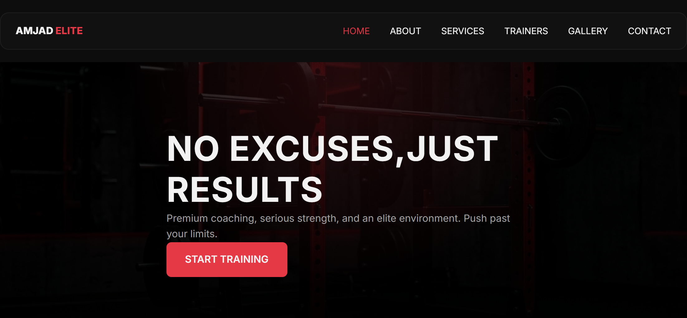
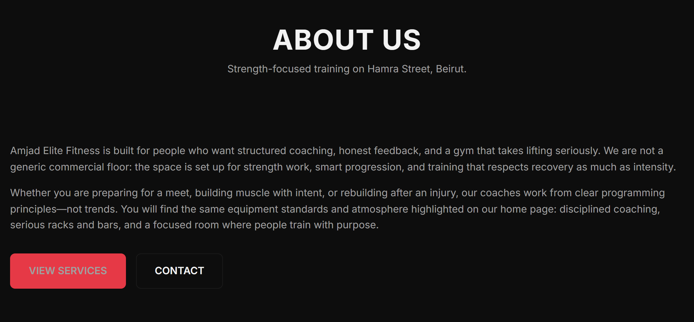
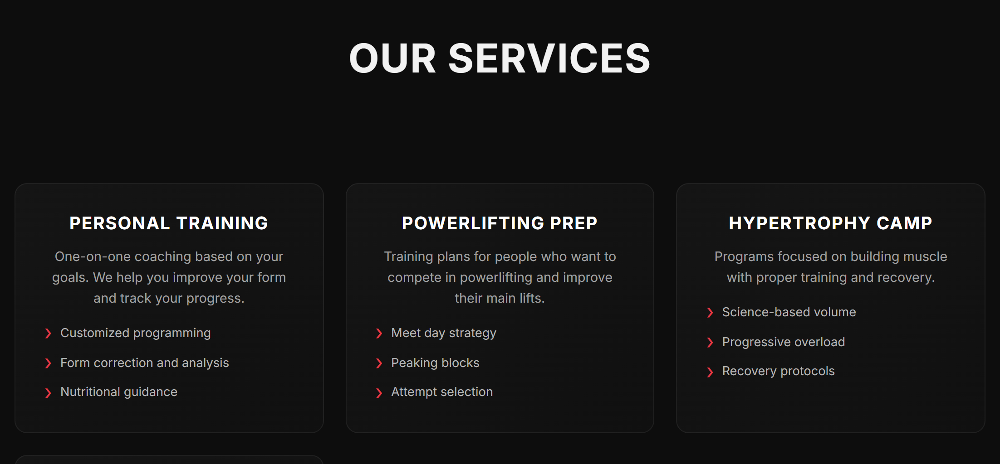
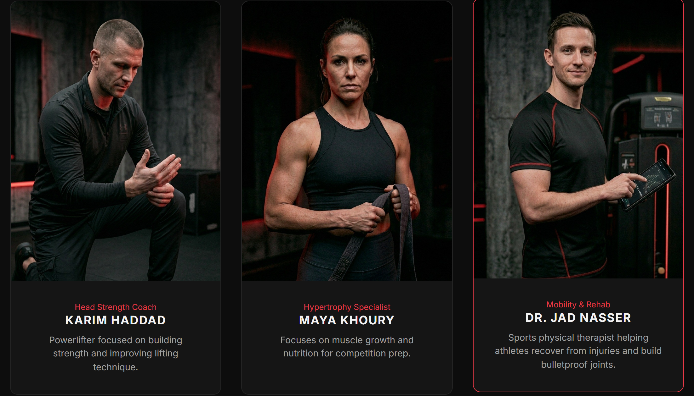
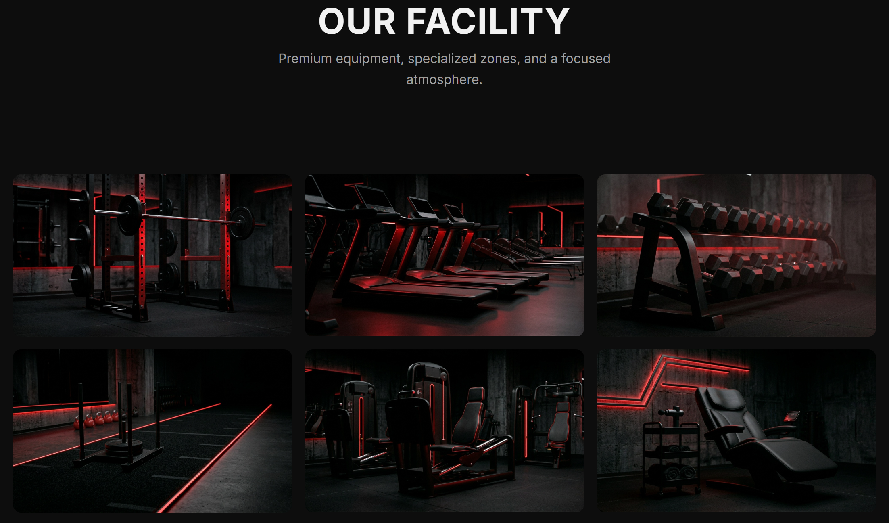
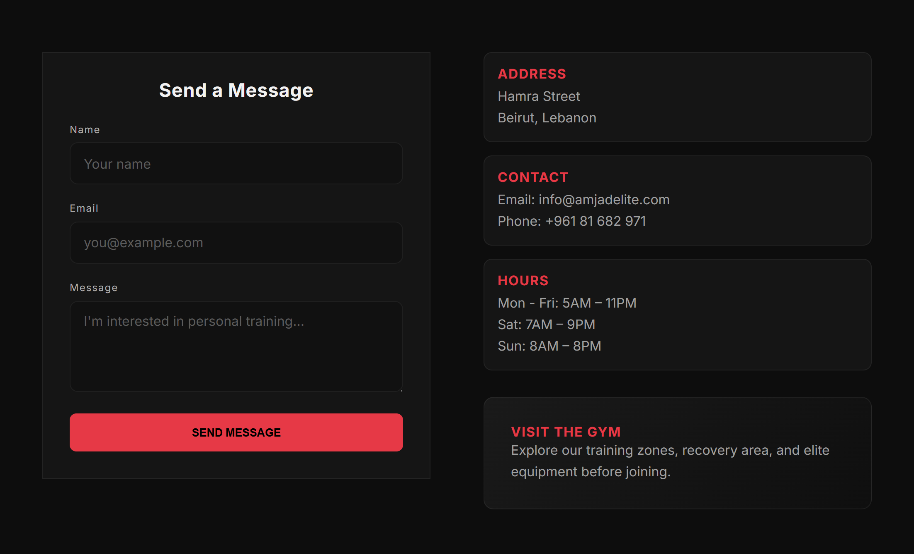

# Amjad Elite Fitness

Website for a gym on Hamra Street, Beirut. This is my **CSCI390 Web Programming** project (Phase 2).

In Phase 1 I built the site with HTML and CSS. For Phase 2 I rebuilt it using **React**, **React Router**, and **Vite** so the pages switch without reloading the whole site.

**Live site:** put your link here after you deploy  
**GitHub:** put your repo link here

## What the site has

- 6 pages: Home, About, Services, Trainers, Gallery, Contact
- Navigation bar and footer on every page (Layout component)
- Mobile menu (hamburger) on small screens
- Contact form — checks that fields are filled, then shows a message (no real server/backend)
- Dark background and red accent color `#e63946`
- All styling is in `src/styles/app.css` (no Bootstrap or Tailwind)

## Technologies

| Tool | Version |
|------|---------|
| React | 18.3.1 |
| React Router | 6.28.0 |
| Vite | 5.4.11 |
| CSS | plain CSS in `app.css` |

## How to run it

You need **Node.js** installed (v18 or newer is fine).

```bash
npm install
npm run dev
```

Then open the link in the terminal (usually `http://localhost:5173`).

To build for production:

```bash
npm run build
npm run preview
```

The built files go in the `dist` folder — that is what you upload to Netlify / Vercel / GitHub Pages.

## Main folders

```
public/images/     → photos (trainers, gym, etc.)
src/components/    → Layout.jsx, Header.jsx, Footer.jsx
src/pages/         → one file per page (Home, About, …)
src/styles/app.css → all CSS
src/App.jsx        → routes
src/main.jsx       → starts React + BrowserRouter
index.html
package.json
vite.config.js
```

## Screenshots

Images are in `docs/screenshots/`:

| Page | File name |
|------|-----------|
| Home | home.png |
| About | about.png |
| Services | services.png |
| Trainers | trainers.png |
| Gallery | gallery.png |
| Contact | contact.png |
| Mobile | mobile.png |

Home:



About:



Services:



Trainers:



Gallery:



Contact:



Mobile:


---

**Course:** CSCI390 Web Programming — Phase 2, Spring 2025–2026  
Lebanese American University
